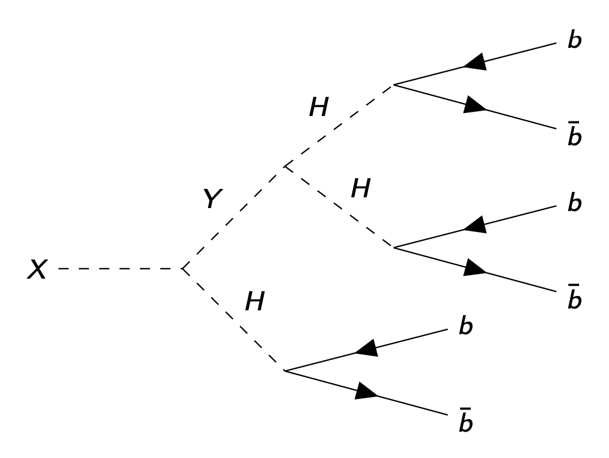

# CMS Physics Analysis Resources 

This page contains links to various resources that are relevant for my graduate research project.

## Introduction

The standard model of particle physics is currently the best existing description of the subatomic world. However, it does not provide a complete explanation for all empirical phenomena. Investigations into theoretical extensions to the standard model are the driving focus of physicists studying data collected from proton-protons collisions at the LHC.

The simplest extension to the standard model features a scalar sector extended beyond the standard model's single SU(2)-doublet Higgs, including consistent supersymmetric extensions requiring at least two Higgs doublets and incorporate explanations for dark matter, as well as general extensions involving two real scalar singlet fields that may provide a deeper understanding of the electroweak symmetry breaking mechanism.

## Analysis

We implement a model-independent approach by studying the most general forms of theoretical extensions to the scalar sector of the standard model. Our current method comprises the development and utilization of machine learning algorithms, such as neural network classification and neural network regression, to aid in the identification and analysis of potential signatures of physics beyond the standard model present in data collected from proton-proton collisions at the LHC.

We are exploring decays involving theretical scalar bosons whose presence and subsequent detection would provide a deeper understanding of electroweak interactions between fundamental particles. These decays yield a final state comprising six *b* jets, which must be detected amongst QCD background and whose combinatoric complications depend on the process by which they are produced.

  <table>
  <thead>
      <tr>
      <th>Feynman Diagram of Possible TRSM Process</th>
      </tr>
  </thead>
  <tbody>
      <tr>
      <td>
          

          
          

      </td>
      </tr>
  </tbody>
  </table>

## Papers and Publications

### Two-real-scalar-singlet extension

- Pruna, G. M., Robens, T. [Higgs singlet extension parameter space in the light of the LHC discovery](https://doi.org/10.1103/PhysRevD.88.115012). Phys. Rev. D 88, 115012 (2013).
- Robens, T., Stefaniak, T. & Wittbrodt, J. [Two-real-scalar-singlet extension of the SM: LHC phenomenology and benchmark scenarios](https://doi.org/10.1140/epjc/s10052-020-7655-x). Eur. Phys. J. C 80, 151 (2020).

### Two Higgs Doublet Model

- Dermisek, R., Lunghi, E., McGinnis, N., Shin, S. [Signals with six bottom quarks for charged and neutral Higgs](10.1007/JHEP07(2020)241). J. High Energ. Phys. 2020, 241 (2020).